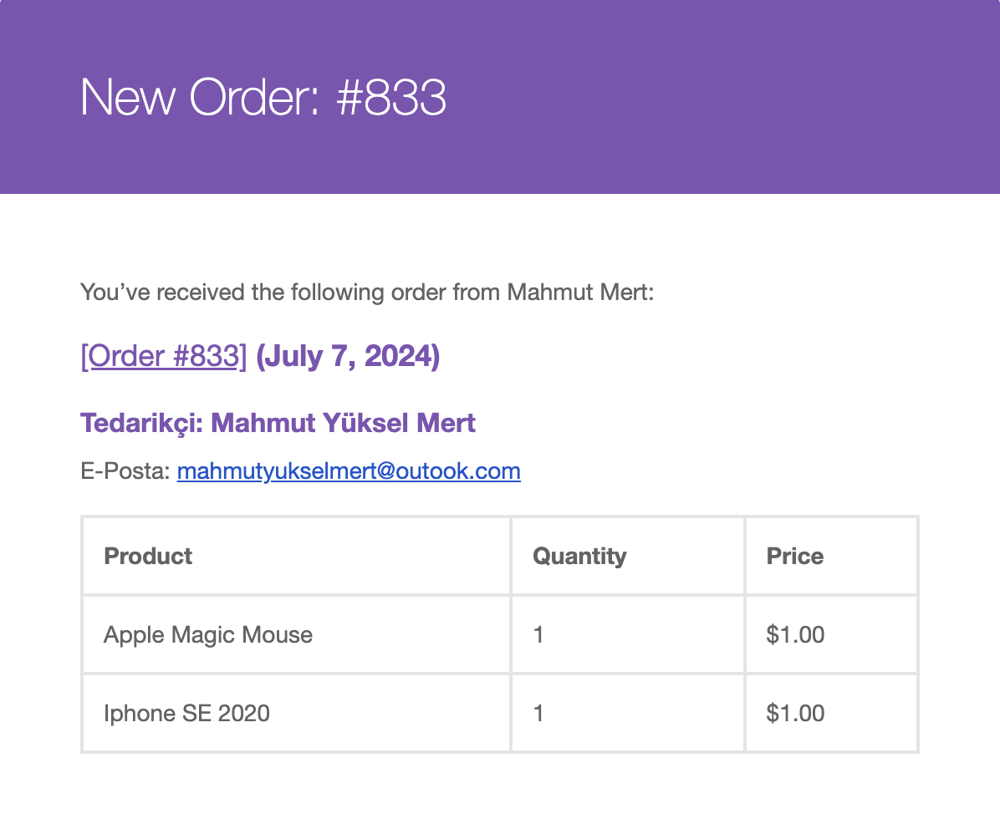

# Supplier Managment For WooCommerce

## Türkçe
WooCommerce üzerinde ürün eklerken, tedarikçileri sisteme kaydetmenize ve ürünlere tedarikçi atamanıza olanak tanıyan bir eklenti. Bu özellik sayesinde tedarikçiler sisteme kaydedilir ve alışveriş sırasında admin'e giden sipariş e-postasında hangi ürünlerin hangi tedarikçiye ait olduğu gruplandırılarak gösterilir. Bu sayede admin, siparişleri tedarikçilerine göre kolayca ayırt edebilir.

## English
A plugin that allows you to register suppliers in the system and assign them to products when adding products on WooCommerce. With this feature, suppliers are recorded in the system, and during the shopping process, the order email sent to the admin shows which products belong to which supplier, grouped accordingly. This makes it easier for the admin to distinguish orders based on their suppliers.

